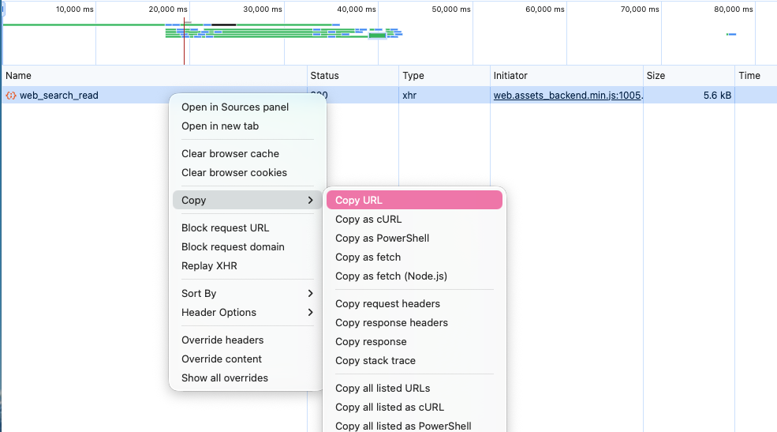
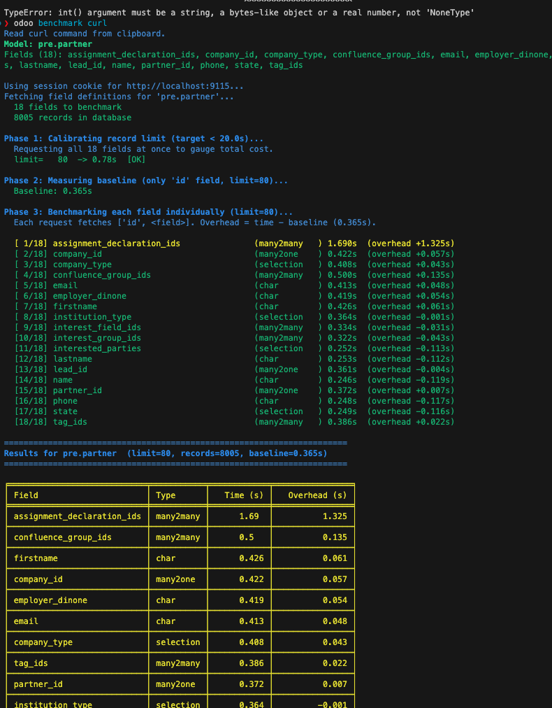

# Benchmarking

zodoo ships a built-in benchmarking tool to find slow computed fields without
manual profiling. It reads every field of a model under real database
conditions and reports which ones are slow.

## `odoo benchmark fields <model>`

```bash
odoo benchmark fields product.product
odoo benchmark fields purchase.order.line
```

Automatically adjusts the record limit so the full run stays under
`--target-seconds` (default `20`), then measures every field individually.

Options:

- `-t` / `--target-seconds`: max seconds for the all-fields baseline (default `20`)
- `-u` / `--user`, `-p` / `--password`: Odoo login credentials
- `-H` / `--host`: Odoo host (e.g. `stage18-odin.dinmedia.de`)
- `-d` / `--db`: database name (default: from project config)

Can be run directly against a remote system with explicit credentials, e.g.:

```bash
odoo benchmark fields res.partner -H stage18-odin.dinmedia.de -u it@zebroo.de -p '********'
```

## `odoo benchmark curl`

Benchmarks the exact fields a slow screen actually requests, using a captured
network request instead of guessing which fields to test:

1. In Chrome DevTools, find the slow `web_search_read` request for the view
   that's loading slowly and copy it as cURL.
2. Run:

   ```bash
   odoo benchmark curl            # reads the cURL command from the clipboard
   pbpaste | odoo benchmark curl  # or pipe it in explicitly
   ```

Host and session cookie are auto-detected from the pasted `curl` command, so
no extra login step is needed. Use `-u`/`-p` (with optionally `-H`/`-d`) to
authenticate with a username/password instead of the captured session.

## Case study: pinpointing an 8-second load time

A mid-sized trading company with around 50 Odoo users reported increasingly
long loading times in the purchasing and warehouse modules — opening product
lists and purchase order overviews caused delays of up to 8 seconds, with no
clear indication of which fields or calculations were responsible.

Running `odoo benchmark fields product.product` and
`odoo benchmark fields purchase.order.line` against the affected models
showed that two computed fields on `purchase.order.line` — a custom margin
field and a forecasted stock level field — were being recalculated on every
database access instead of being cached. Both were missing `store=True`.

After setting `store=True` on both fields and re-running the benchmark, the
average load time of the purchase order overview dropped from 8 seconds to
under 1 second — the tool pinpointed the issue within minutes, without manual
debugging or a separate profiling setup.

### Grabbing the cURL command from DevTools



### Example benchmark run output



`odoo benchmark fields` is the fastest way to diagnose field-level
performance issues in an Odoo project — it isolates the slow field without
requiring a manual code review or a full profiler, which makes it practical
to use as a first response whenever a screen is reported as slow.
